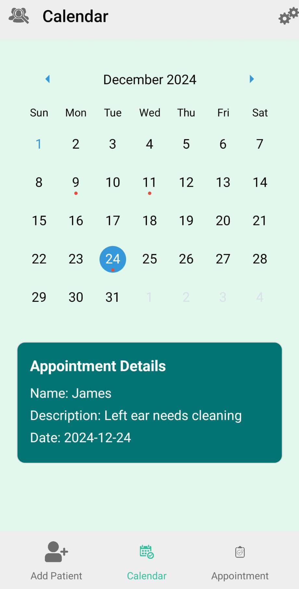
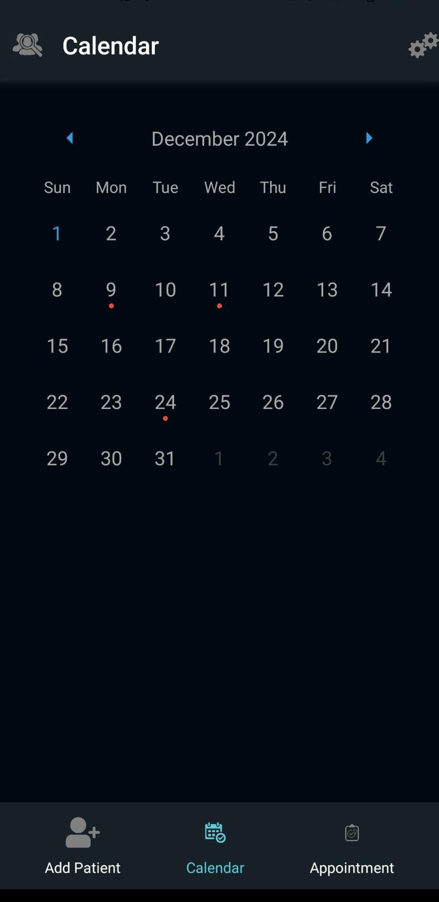
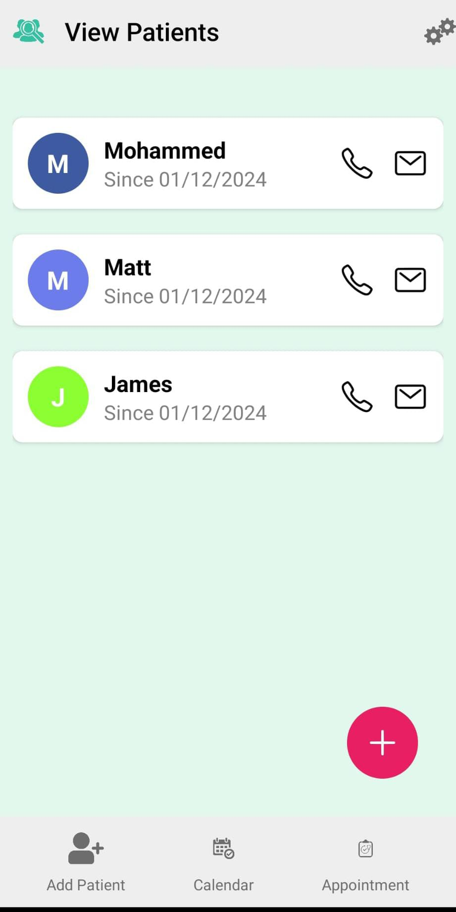

# Clear Ear Appointment Tracking App

**Clear Ear** is an ENT clinic specializing in audiology and ear health. They hired me to develop a robust mobile app to streamline their appointment tracking, patient management, and historical data recording. This app ensures efficient management of bookings and enables the clinic to maintain detailed records of patient visits, medications, and personal history.

---

## Features

### 🎯 Appointment Tracking
- Users can view and manage all upcoming and past appointments.
- Quick navigation through booked schedules for better time management.

### 🧑‍⚕️ Patient Management
- View all stored patients in the database.
- Access detailed records, including past appointments, medical descriptions, and personal information.

### 🌗 Light & Dark Modes
- Designed with accessibility and user comfort in mind.
- Switch between light mode for daytime use and dark mode for nighttime or low-light environments.

---

## How I Built This

### Frontend
The app was developed using **React Native**, providing a smooth, user-friendly interface with cross-platform compatibility for both iOS and Android devices.

### Backend
A local database was implemented using **AsyncStorage** to store patient records, appointment details, and other critical information securely.

---

## Screenshots

### 1️⃣ **Light Mode: Calendar View**  
The front page of the app where users can see all booked appointments in an easy-to-navigate calendar format.



---

### 2️⃣ **Dark Mode: Calendar View**  
The same intuitive calendar functionality, but in a sleek, dark theme for comfort in low-light settings.



---

### 3️⃣ **View Patients: Detailed Records**  
Access a comprehensive list of all patients stored in the database, along with their appointment history, descriptions, and personal details.



---

## Getting Started

1. Clone the repository:  
   ```bash
   git clone https://github.com/Mohammed-Bakhshi/Clear-ear-
   cd Clear-ear
